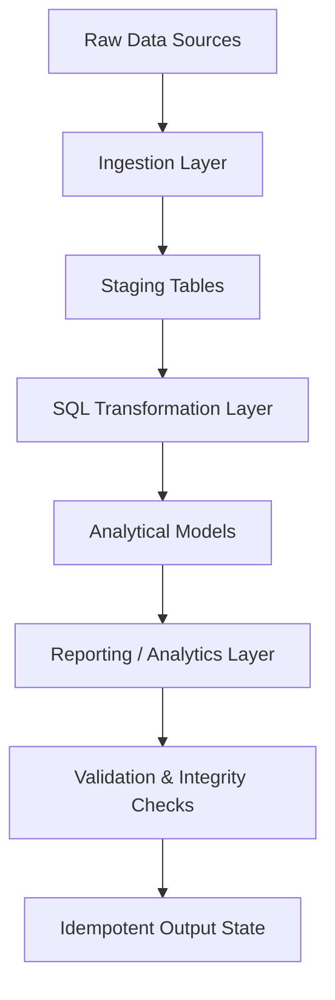

## 🦆 Architecture isn't what you build. It's what you never have to rebuild

Enterprise-Grade SQL Pipeline Infrastructure for Reproducible Data Systems
> A fully idempotent, end-to-end data engineering system designed to demonstrate production-style pipeline design, deterministic SQL transformations, and reproducible data infrastructure that ingests, validates, models, and publishes over **9 million records** through a deterministic **one-command execution** pipeline.

<p align="center">
  
  
  
  
  
  
</p>

<p align="center">
  
</p>

---
### Executive Summary
This platform demonstrates how enterprise-grade data engineering systems can be architected for deterministic execution, reproducible analytics, and AI-ready data foundations. By combining idempotent pipeline orchestration with layered data modeling and automated validation, the platform delivers a repeatable foundation for analytics, machine learning, and decision intelligence systems.

> Although this repository focuses on data engineering, its primary purpose is to provide the deterministic data foundation upon which AI models, agentic systems, and enterprise decision intelligence platforms depend.

---
### Core Capability

#### One-Line System Execution

```bash
duckdb dw_marts.duckdb -c ".read build_dw_marts.sql"
```
This executes the full pipeline end-to-end, including:

 - Environment initialization
 - Data ingestion
 - SQL-based transformations
 - Model staging tables
 - Analytical output generation
 - Validation checks

> The system is fully idempotent — repeated executions produce identical outputs without duplication, drift, or state corruption.
> Run it once — you get the platform.
> Run it again — you get the **same** platform, clean.
> No manual teardown. No state management. No surprises. **This is how production pipelines should behave.**
---

### Business Problem

Modern data engineering systems often fail at three critical points:

 - Lack of reproducibility across environments
 - Manual pipeline execution dependencies
 - Non-deterministic transformation logic
 - Fragmented SQL workflows across teams

As a result, downstream analytics, machine learning systems, and decision pipelines are built on unstable data foundations.

> This system solves that problem by enforcing deterministic, repeatable, and version-controlled data transformation logic.
---

### The Architecture


---
### Design Principles

#### Idempotency by Design:
 - Every pipeline stage can be executed repeatedly without side effects or duplication.

#### Deterministic SQL Transformations:
 - All transformations are version-controlled and environment-independent.

#### Reproducible Infrastructure:
 - The system can be fully rebuilt from scratch using a single command.

#### Layered Data Architecture:
 - Clear separation between ingestion, staging, transformation, and analytics layers.

#### Validation-Driven Output Integrity:
 - Every execution includes built-in consistency and integrity checks.
---
### Key Engineering Decisions

**Star over snowflake** — Simpler joins, better performance for analytical workloads, easier for BI consumers who don't want to write five-table joins.

**Median over average** — Outliers distort salary averages. Median tells the truth.

**Logarithmic demand scaling** — Prevents high-volume skills from dominating optimal scoring. Finds the true salary × demand intersection.

**Sentinel row for nulls** — `skill_id = 0` absorbs missing skill associations without data loss or FK violations.

**URL-based data loading** — Source data loads from GCS directly. No local file dependencies. Runs anywhere DuckDB runs.

**One-command deploy** — Not a convenience feature. A deliberate signal about how production pipelines should be built and handed off.

> **Finding-neutral by design** — The warehouse carries no embedded conclusions. Every mart and analytical layer is architected to support any question, not just the ones I asked. Salary, demand, role priority, time series — the platform serves the analyst's lens, not the builder's opinion.
---

### System Components
#### Data Ingestion Layer:
 - Structured loading of raw datasets
 - Environment-agnostic ingestion logic
 - Schema normalization
#### Staging Layer:
 - Raw-to-clean transformation boundary
 - Data type enforcement
 - Deduplication logic
#### Transformation Layer :
 - Business logic implemented entirely in SQL
 - Modular transformation scripts
 - Reusable data models
#### Analytical Layer:
 - Aggregated outputs for reporting
 - Metric computation and rollups
 - Downstream AI/ML readiness preparation
#### Validation Layer:
 - Row count validation
 - Schema integrity checks
 - Pipeline consistency verification
   
---

### Why This Matters
Enterprise AI systems are only as strong as their underlying data infrastructure.

Without deterministic, reproducible data pipelines:

 - AI models drift
 - Metrics become inconsistent
 - Decision systems lose reliability
 - Infrastructure scaling becomes unpredictable

> This system ensures that data foundations are stable, repeatable, and production-grade.
---

### Strategic Positioning

This repository represents the Data Engineering Foundation Layer of a broader AI architecture framework:

 - AI Infrastructure Intelligence Systems
 - Enterprise Agent Platforms
 - Decision Intelligence Systems
 - FinOps & Infrastructure Optimization Models
 - Governance & AI Operating Models

> Every advanced AI system depends on this layer being correct, reproducible, and deterministic.

### Key Insight

You cannot build reliable AI systems on non-reproducible data pipelines.

> This project demonstrates how data engineering becomes a foundational constraint layer for enterprise AI systems.

| Table | Type | Records | Description |
|---|---|---|---|
| `job_postings_fact` | **Fact** | 1,615,930 | Core job posting data — the center of the star |
| `company_dim` | **Dimension** | 215,940 | Company profiles across 20 countries |
| `skills_dim` | **Dimension** | 262 | Unique skills with type classification |
| `skills_job_dim` | **Bridge** | 7,193,426 | Many-to-many skill-to-job relationships |

**Total: 9,025,356 rows of real market data.**

----
#  Engineering Deep Dive 


### The Master Build Script

```bash
duckdb dw_marts.duckdb -c ".read build_dw_marts.sql"
```

### What Idempotent Means Here

Every script uses `DROP ... IF EXISTS` and `CREATE OR REPLACE` patterns.

Run it once — you get the platform.
Run it again — you get the **same** platform, clean.

No manual teardown. No state management. No surprises. **This is how production pipelines should behave.**

### Build Order & Why It Matters

```sql
-- MASTER BUILD SCRIPT
-- duckdb dw_marts.duckdb -c ".read build_dw_marts.sql"

.read 01_create_tables_dw.sql               -- Step 1: Star schema DDL with FK constraints
.read 02_load_schema_dw.sql                 -- Step 2: Load 9M+ rows from GCS via URL
.read 03_create_flat_mart.sql               -- Step 3: Denormalized flat mart for BI tools
.read 04_create_skills_mart.sql             -- Step 4: Skills demand mart with time series
.read 05_create_priority_mart.sql           -- Step 5: Priority roles snapshot mart
.read 06_batch_updates_priority_mart.sql    -- Step 6: MERGE-based upserts
```

> Foreign key constraints enforce referential integrity throughout. Dimension tables must exist before fact tables. Fact tables before marts. **The build order reflects the dependency graph of the entire platform** — not an arbitrary sequence.
---

## Pipeline Deep Dive

### Step 1 — Schema Creation (`01_create_tables_dw.sql`)

Full constraint enforcement from day one:

- Primary keys on all dimension tables
- Foreign keys linking fact table to dimensions
- Composite primary keys on the bridge table
- Data types optimized for analytical workloads

**Key engineering decision:** A `skill_id = 0` sentinel row handles job postings with no associated skills — preventing FK violations without data loss.

```sql
INSERT INTO skills_dim (skill_id, skills, type)
SELECT 0, 'Unknown', 'Unknown'
WHERE NOT EXISTS (
    SELECT 1 FROM skills_dim WHERE skill_id = 0
);
```

This is the difference between a pipeline that breaks on edge cases and one that handles reality.

---

### Step 2 — Data Loading (`02_load_schema_dw.sql`)

Source data loads directly from Google Cloud Storage via URL. **No local files required.**

```sql
INSERT INTO company_dim (company_id, name)
SELECT company_id, name
FROM read_csv('https://storage.googleapis.com/sql_de/company_dim.csv',
    AUTO_DETECT=TRUE);
```

Validation runs after every load:

```sql
SELECT 'Company Dim'        AS table_name, COUNT(*) AS record_count FROM company_dim
UNION ALL
SELECT 'Skills Dim',        COUNT(*) FROM skills_dim
UNION ALL
SELECT 'Job Postings Fact', COUNT(*) FROM job_postings_fact
UNION ALL
SELECT 'Skills Job Dim',    COUNT(*) FROM skills_job_dim;
```

Expected output — every time:

```
┌───────────────────┬──────────────┐
│ Company Dim       │       215940 │
│ Skills Dim        │          262 │
│ Job Postings Fact │      1615930 │
│ Skills Job Dim    │      7193426 │
└───────────────────┴──────────────┘
```

---

### Step 3 — Flat Mart (`03_create_flat_mart.sql`)

A fully denormalized surface joining all dimensions to the fact table. Downstream consumers in Excel, Power BI, and Python query this directly — **no join logic required from the consumer**.

**Output:** 1,615,930 rows. Everything in one queryable surface.

---

### Step 4 — Skills Demand Mart (`04_create_skills_mart.sql`)

Purpose-built mart with its own star schema inside the `skills_mart` schema:

| Table | Records | Description |
|---|---|---|
| `skills_mart.dim_skills` | 262 | All unique skills |
| `skills_mart.dim_date_month` | 30 | Monthly buckets: 2023 Q1 → 2025 Q2 |
| `skills_mart.fact_skill_demand_monthly` | 52,520 | Monthly skill demand by role |

**What makes this mart powerful:** Every skill tracked monthly across 30 months, segmented by job role, with remote work, health insurance, and degree requirement flags.

```sql
CASE WHEN jpf.job_work_from_home = TRUE THEN 1 ELSE 0 END    AS is_remote,
CASE WHEN jpf.job_health_insurance = TRUE THEN 1 ELSE 0 END  AS has_health_insurance,
CASE WHEN jpf.job_no_degree_mention = TRUE THEN 1 ELSE 0 END AS no_degree_mentioned
```

Boolean flags cast to integers — aggregatable without CASE logic downstream.

---

### Step 5 — Priority Mart (`05_create_priority_mart.sql`)

A role-priority snapshot mart tracking high-value engineering roles with configurable priority tiers:

```
┌──────────────────────────┬────────────┬──────────────┐
│ Data Engineer            │    391,957 │  Priority 1  │
│ Data Scientist           │    331,002 │  Priority 3  │
│ Software Engineer        │     92,271 │  Priority 3  │
│ Senior Data Engineer     │     91,295 │  Priority 1  │
└──────────────────────────┴────────────┴──────────────┘
```

---

### Step 6 — Batch Updates (`06_batch_updates_priority_mart.sql`)

MERGE-based upsert pattern. New roles insert. Existing roles update. **No full rebuilds.**

```sql
MERGE INTO priority_mart.priority_jobs_snapshot AS tgt
USING src_priority_jobs AS src
ON tgt.job_id = src.job_id
WHEN MATCHED THEN
    UPDATE SET priority_level = src.priority_level, ...
WHEN NOT MATCHED THEN
    INSERT (job_id, title, priority_level, ...) VALUES (...);
```

Enterprise-grade SCD (Slowly Changing Dimension) thinking applied to a job market platform.

---

## ✅ Data Validation — Nothing Runs Silently

Every script emits validation output. Progress bars. Row counts. Explicit confirmation at every stage.

```
100% ▕████████████████████████████████████▏ (00:00:04.78 elapsed)

┌───────────────────┬──────────────┐
│ Job Postings Fact │      1615930 │
│ Skills Job Dim    │      7193426 │
└───────────────────┴──────────────┘
```

If the numbers don't match, you know immediately — not three steps later.

---

## 📁 Project Structure

```
SQL_Data_Engineering_Projects/
│
├── 2_Pipeline_ETL/
│   ├── build_dw_marts.sql                    # ← Run this. Builds everything.
│   ├── 01_create_tables_dw.sql               # Star schema DDL
│   ├── 02_load_schema_dw.sql                 # Data pipeline from GCS
│   ├── 03_create_flat_mart.sql               # Flat analytical mart
│   ├── 04_create_skills_mart.sql             # Skills demand mart w/ time series
│   ├── 05_create_priority_mart.sql           # Priority roles snapshot mart
│   └── 06_batch_updates_priority_mart.sql    # MERGE batch upserts
│
├── 1_EDA/
│   └── [Exploratory findings built on this warehouse]
│
└── Images/
    ├── project Scope.jpg                     # Full pipeline architecture
    └── Data-Warehouse_1.jpg                  # Star schema diagram
```

---


### This warehouse powers three analytical findings:

- **Top demanded skills** — What the market is actually hiring for
-  **Highest paying skills** — Where compensation concentrates
-  **Optimal skills** — The salary × demand intersection that no spreadsheet will show you

→ **[Explore the EDA & Findings](./1_EDA)**
---

# Free Tier Quickstart — Query Live Data in 2 Minutes

No installs. No infrastructure. No credit card.

**Step 1 — Get a free MotherDuck account**

→ Go to [motherduck.com](https://motherduck.com) and sign up for free (takes 30 seconds)

**Step 2 — Open the MotherDuck SQL editor and run this single line**

```sql
ATTACH 'md:_share/dw_marts/05413662-8da3-4400-a371-4f2258399608';
```

**Step 3 — You're in. Start querying 9 million rows of live job market data.**

```sql
-- What are the top 10 most demanded skills in the market right now?
SELECT
    sd.skills,
    COUNT(*) AS demand_count
FROM dw_marts.job_postings_fact jpf
JOIN dw_marts.skills_job_dim sjd ON jpf.job_id = sjd.job_id
JOIN dw_marts.skills_dim sd ON sjd.skill_id = sd.skill_id
GROUP BY sd.skills
ORDER BY demand_count DESC
LIMIT 10;
```

> **That's it.** You're connected to a production-grade star schema data warehouse with 9M+ rows — live, shared, and free to explore.

---

## 📜 License

MIT — Use it, fork it, build on it. Attribution appreciated.

---

<p align="center">
  Built by <strong>Tracy Anne Griffin Manning</strong> &nbsp;|&nbsp; Principal Architect &nbsp;|&nbsp;
  <a href="https://github.com/TAM-DS">Apex AI|ML Engineering</a>
</p>

<p align="center">
  <em>"Architecture isn't what you build. It's what you never have to rebuild."</em>
</p>
